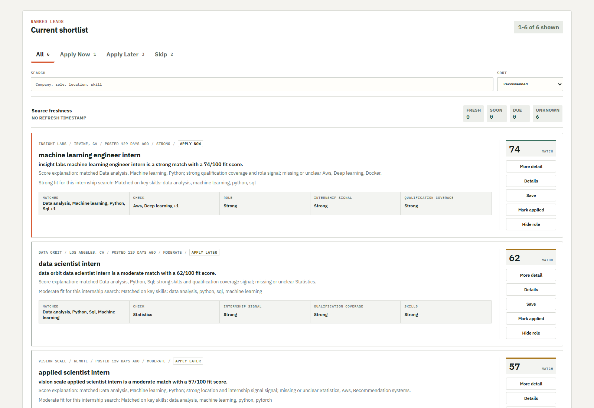
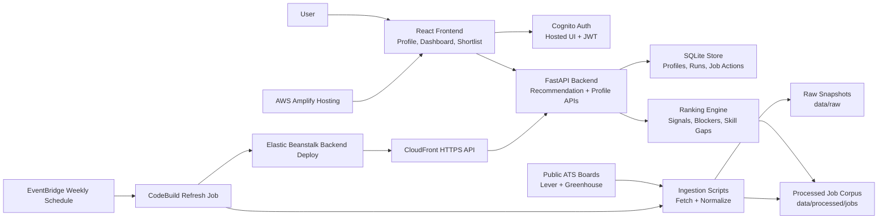
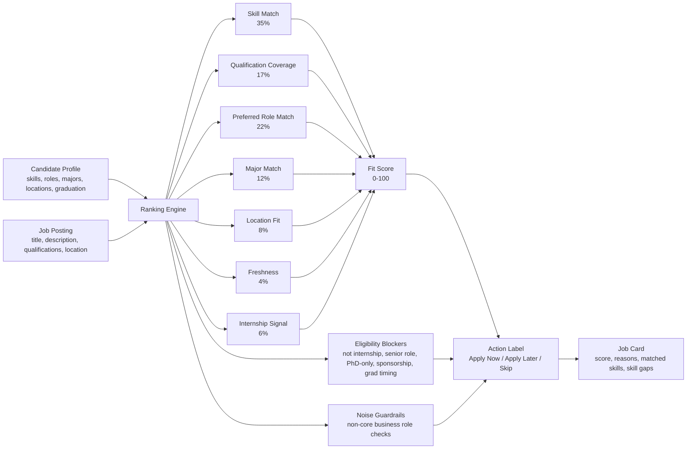

# InternLens

InternLens is a demoable internship discovery product prototype.

It fetches public internship postings from Lever and Greenhouse boards, normalizes them into a shared corpus, ranks them against a structured candidate profile, and exposes the workflow through a FastAPI backend and a Vite/React frontend.

Live staging app:

```text
https://main.d1d00e49guhewo.amplifyapp.com
```



Representative shortlist view from the redesigned application workspace. The live UI shows the saved profile and pipeline overview above this review list.

## Project Diagram



## How Ranking Works



For the detailed scoring rules, see [docs/architecture/ranking_logic.md](docs/architecture/ranking_logic.md).

## What It Does

- Maintains a refreshed internship corpus from public ATS job boards.
- Scores roles with an explainable heuristic ranking model.
- Lets users save a structured profile behind Cognito-backed account scope.
- Shows searchable, paginated shortlists with visible match signals.
- Tracks saved, applied, and hidden jobs per user.
- Runs a weekly AWS refresh/deploy path so the staging backend can pick up newer job data automatically.

## Current Product Surface

The browser workflow supports:

- public landing page with sign-in entry
- account-scoped Profile Setup
- reviewable resume upload import with confidence and evidence for skills, majors, roles, industries, locations, education timeline, and background text
- searchable role, skill, major, location, and industry selectors
- recommendation runs over the current processed corpus
- shortlist search, sorting, and 20-item pagination
- visible-by-default match signals with optional hiding
- score explanations, matched skills, skill gaps, and job detail modals
- save, mark applied, hide role, and undo actions
- dashboard views for shortlists, saved, applied, and hidden jobs

## Architecture At A Glance

Main runtime pieces:

- Backend: `src/api/app.py`
- Resume parser: `src/preprocessing/resume_parser.py`
- Ranking: `src/ranking/baseline_scorer.py`
- Job loading: `src/preprocessing/job_parser.py`
- Profile persistence: `src/storage/profile_store.py`
- Frontend: `frontend/src/main.jsx`
- AWS backend packaging: `scripts/package_eb.py`
- Weekly refresh deploy: `buildspec.weekly-refresh.yml`
- Ranking quality report: `scripts/generate_ranking_quality_report.py`

## Quick Start

Backend:

```powershell
.\.venv\Scripts\python.exe -m uvicorn src.api.app:app --reload
```

Frontend:

```powershell
cd frontend
npm run dev
```

Useful validation:

```powershell
.\.venv\Scripts\python.exe -m pytest -q
cd frontend
npm run lint
npm test -- --run
npm run build
```

After refreshing or deploying the job corpus, verify that the processed corpus has non-expired jobs:

```powershell
.\.venv\Scripts\python.exe scripts\check_corpus_health.py
```

For full local commands, source refresh commands, CLI ranking examples, and API examples, see [docs/development/local_workflows.md](docs/development/local_workflows.md).

## AWS Staging

Current staging shape:

- Frontend: AWS Amplify Hosting
- Backend: Elastic Beanstalk behind CloudFront
- Auth: Cognito Hosted UI / JWT mode
- Backend deploy: CodePipeline + CodeBuild
- Weekly corpus refresh: EventBridge -> CodeBuild -> Elastic Beanstalk
- Failure notification topic: SNS

GitHub Actions `refresh-job-corpus` is artifact-only: it refreshes data on the GitHub runner and uploads a `refreshed-job-corpus` artifact, but it does not update a local checkout, commit generated data, or deploy staging. The staging backend corpus is updated by the AWS CodeBuild weekly refresh/deploy path below. Both paths retry transient ATS failures, preserve per-source diagnostics, tolerate at most two final board failures, and run `scripts/check_corpus_health.py` so a green run still requires a healthy non-expired corpus.

Latest verified weekly refresh path:

```text
EventBridge rule: internlens-weekly-corpus-refresh
Schedule: cron(0 9 ? * MON *)
CodeBuild project: internlens-weekly-corpus-refresh
Elastic Beanstalk environment: internlens / Internlens-env
Latest deployed weekly version: weekly-corpus-20260514031631-5d9ae2d3b1fa
```

See [docs/deployment/aws_staging.md](docs/deployment/aws_staging.md) for setup, permissions, smoke checks, and credential guidance.

## Documentation Map

- [Architecture overview](docs/architecture/overview.md)
- [Ranking logic](docs/architecture/ranking_logic.md)
- [Data schema](docs/architecture/schema.md)
- [Source acquisition strategy](docs/architecture/source_acquisition_strategy.md)
- [Local workflows](docs/development/local_workflows.md)
- [AWS staging deployment](docs/deployment/aws_staging.md)
- [Latest development log](docs/devlog/week8.md)

## Quality Checkpoint

Recent validation checkpoints:

- Local backend suite after refresh resilience updates: `226 passed`
- Backend suite in weekly CodeBuild: `200 passed`
- Frontend suite: `30 passed`
- Frontend lint and production build: passing
- Corpus health gate: refresh artifacts and weekly deploys must contain at least one non-expired processed job
- Deployment smoke now checks `health`, auth protection, OpenAPI schema, and the public recommendation corpus

## Project Status

InternLens is a strong prototype, not a production system.

What is solid:

- public ATS ingestion and normalized corpus generation
- account-scoped profile, recommendation, dashboard, and job-action APIs
- explainable heuristic ranking
- usable frontend shortlist workflow
- AWS staging deployment and weekly corpus refresh automation
- regression coverage across ingestion, ranking, API, packaging, and frontend helpers/components

Main limitations:

- SQLite is still single-host prototype persistence.
- Ranking is heuristic, not learned or embedding-based.
- Public ATS data is noisy and sometimes sparse.
- Source discovery and promotion remain operator-reviewed.
- Frontend tests are still mostly helper and server-rendered component checks, not full browser interaction tests.

## Next Priorities

- Move persistence to managed database storage before production use.
- Add browser-level frontend interaction tests.
- Continue reducing false positives in broader non-CS shortlists.
- Improve company/team/location normalization.
- Add better operational alerts and dashboard visibility for scheduled refresh runs.
